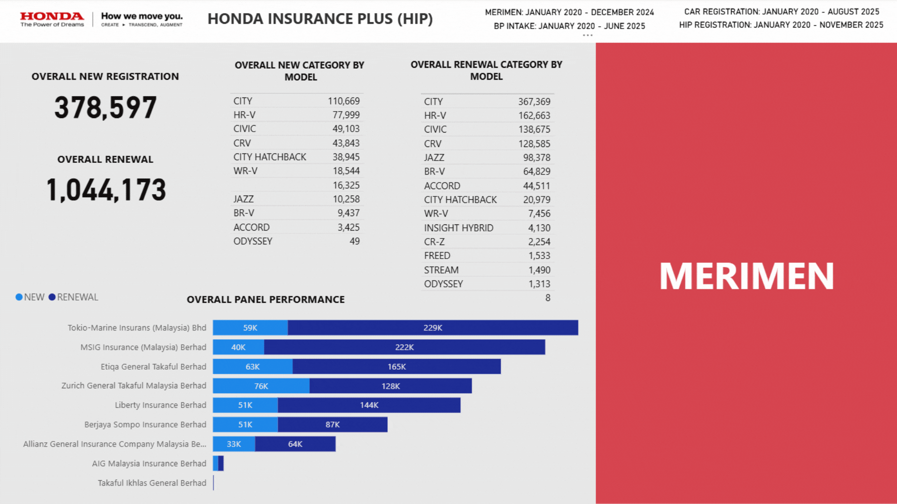

<h3 align="center">Honda Insurance Plus (HIP) Dashboard</h3>

---

<h4 align="center">This is the second dashboard I have developed during my Protege at Honda Malaysia for HIP Team</h4>

---

The **Honda Insurance Plus (HIP) Dashboard** is an interactive Power BI dashboard designed to provide comprehensive insights into the performance and customer trends of the **Honda Insurance Plus (HIP)** program.

## 📊 Overview

This dashboard enables users to analyze and monitor the registration trends of HIP customers, distinguishing between **new subscriptions** and **renewal customers** while also tracking **claim activities** and **Body & Paint dealer intake**.

The data covers the period from **January 2020 to the present**, allowing users to identify long-term patterns, customer behavior, and the impact of HIP on dealership performance.

## 🎯 Key Objectives

- To monitor the **number of HIP registrations** by customer type (New vs Renewal).  
- To analyze **claims made by customers**, including the **total amount claimed** and **type of claim**.  
- To track the **movement of HIP customers** and their connection with **Body & Paint dealer intake**.  
- To identify the **proportion of dealer customers** originating from HIP subscriptions.

## 🧠 Insights Delivered

- How HIP registrations have evolved over time.  
- Which claim types are most common among customers.  
- The correlation between HIP customers and Body & Paint dealer visits.  
- Data-driven understanding of customer retention and engagement patterns.

---

## 🏠 Main Page

The **Main Page** acts as the central navigation hub of the **Honda Insurance Plus (HIP) Dashboard**, offering users a clear entry point to explore both the **Registration** and **Merimen** analytics sections.  

This page is designed to give users a quick snapshot of the overall HIP landscape, where each category provides a high-level summary of its key performance aspects. By hovering over the respective buttons, users can preview insights related to each category such as registration trends or claim activities and easily navigate to the detailed analysis pages with a single click.  

The layout prioritizes simplicity and interactivity, ensuring a smooth transition between sections of the dashboard. Additionally, the **Last Updated Date** displayed at the top of the page informs users of the latest data refresh, maintaining confidence in the dashboard’s accuracy and timeliness.  

Overall, the Main Page serves as both a **dashboard overview** and a **navigation control center**, guiding users toward deeper insights while maintaining an intuitive and visually engaging interface.

## 📄 Performance (Registration)

The **Performance (Registration)** page offers a comprehensive view of **HIP customer registration trends**, enabling users to assess how the program has evolved over time. It highlights both **new and renewal registrations**, helping users understand customer acquisition and retention patterns across different years.

The bar chart provides a clear visualization of the **yearly trend** between new and renewal customers. Users can toggle the view to compare **new car registrations** with **new HIP subscriptions**, uncovering the relationship between vehicle purchases and HIP adoption rates. This comparison helps identify periods of growth, decline, or correlation between sales activity and insurance uptake.

A **pie chart** presents the **Honda Touch (HT) user distribution**, offering insight into how many HIP customers are also engaged within the Honda Touch ecosystem, an indicator of digital platform integration and customer loyalty.  

Additionally, the **Top 10 Renewal Distribution** chart ranks renewal patterns based on **car registration year**, revealing which batches of customers are most likely to renew their HIP subscriptions. This insight helps stakeholders identify retention opportunities and focus on specific customer segments.

The page also includes slicers for **business type**, **dealer**, **registration year**, **model**, and **year**, allowing users to interactively filter data and perform deeper, segment-specific analyses. Together, these visuals make the page a central tool for tracking HIP registration performance and customer behavior trends.

## 📄 Demography (Registration)

The **Demography (Registration)** page provides a comprehensive understanding of the **HIP customer base**, allowing users to explore who the customers are and how different demographic factors influence their participation in the program.  

Through a combination of visual analytics, this page uncovers demographic trends such as **gender**, **race**, **age**, **occupation**, and **income distribution**, giving stakeholders a clearer picture of the audience engaging with HIP.

The **gender treemap** and **race pie chart** highlight proportional representation among HIP customers, helping identify whether the program appeals more strongly to certain demographic groups. The **marital status donut chart** adds another dimension by showing how family background may relate to insurance adoption patterns.

The **age category** and **occupation** bar charts provide further insights into the primary age groups and professional backgrounds of HIP customers. These visuals can guide marketing and engagement strategies by pinpointing which segments contribute most to the customer base.  

Additionally, the **income range** and **regional distribution** charts reveal how socioeconomic factors and geographic locations correlate with HIP participation, helping the business identify potential growth areas and underserved regions.

Interactive slicers for **dealer name**, **registration year**, **car model**, and **year** allow users to dynamically filter and segment the data, making it easy to drill down into specific customer groups or compare patterns across different time frames.

Overall, this page enables a **data-driven understanding of the HIP demographic landscape**, supporting more informed decision-making in customer targeting and retention strategies.

## 📄 Model (Registration)

The **Model (Registration)** page focuses on understanding the relationship between HIP participation and different **Honda car models**. It provides insights into which vehicle models attract the most HIP users and how these trends evolve over time.

At the top of the page, the **Honda Touch (HT) User Distribution** pie chart illustrates the proportion of HIP customers who are also Honda Touch users. This helps identify the level of digital engagement among different car model owners and the overlap between service platform users and insurance subscribers.

The **Model Distribution** bar chart highlights which car models are most commonly associated with HIP subscriptions. By visualizing the total number of HIP customers per model, stakeholders can quickly identify top-performing models and potential opportunities for targeted campaigns.

Complementing this, the **Model Distribution Table Matrix** provides a detailed breakdown of each model by **year** and **customer status** (New vs. Renewal). This enables a more granular analysis of customer retention and reveals whether certain models tend to have higher renewal rates or attract more new subscribers over time.

Interactive slicers for **dealer name**, **car model**, **registration year**, and **year** allow users to dynamically explore specific data subsets, making it easier to uncover performance variations across dealers, time periods, and model categories.

Overall, this page helps stakeholders assess **model-specific engagement trends**, guiding strategic decisions in marketing, dealership performance tracking, and customer retention planning.

## 📄 Panel (Registration)

The **Panel (Registration)** page provides insights into the **HIP customer distribution by insurance panel and car model**, allowing stakeholders to understand how different panels and vehicle types relate to customer registration patterns.

At the center of the page, a **donut chart** visualizes the **status of HIP customers** — distinguishing between **new** and **renewal** subscriptions. This gives a quick snapshot of the balance between customer acquisition and retention.  

A **bar chart** shows the **distribution of car models**, helping users identify which models are most represented among HIP subscribers and highlighting trends in model-specific adoption.  

The **horizontal bar chart** focuses on the **HIP user distribution across insurance panels**, providing insights into customer preferences for insurance partners. This helps the business evaluate panel popularity, identify underrepresented panels, and guide future partnerships or promotions.

Interactive slicers for **business type**, **dealer**, **registration year**, and **year** allow users to filter the data dynamically, enabling deeper exploration of customer registration patterns across specific dealers, time periods, and business segments.

Overall, this page gives a **comprehensive view of the intersection between customer status, car models, and insurance panels**, supporting data-driven decisions for retention strategies, model promotions, and panel management.

## 📄 Dealer (Registration)

The **Dealer (Registration)** page provides a detailed view of **HIP registrations at the dealer level**, offering insights into dealer performance, customer distribution, and trends over time.

At the top, a **donut chart** visualizes the **status of HIP customers** (New vs. Renewal), giving a quick overview of acquisition and retention across all dealers. A second **donut chart** shows the **business type of each dealer** (1S, 2S, 3S, or Body & Paint), helping stakeholders understand the composition of dealers contributing to HIP registrations.

A **dealer table** lists each **dealer name** alongside their **total HIP registrations**, making it easy to identify top-performing dealers and track overall contributions.  

At the bottom of the page, a **pie chart** displays **dealer distribution by region**, providing insights into geographic trends and helping identify areas of strong or weak performance.  

Finally, a **line chart** visualizes the **HIP registration trend over time** by year and month, allowing users to drill up or down to explore detailed temporal patterns and seasonal variations in customer behavior.

Interactive slicers for **dealer**, **car model**, **registration year**, and **year** allow users to dynamically filter the data, enabling deeper analysis by specific dealers, models, or time periods.  

Overall, this page enables stakeholders to **assess dealer-level performance**, identify high-value dealers, and monitor regional and temporal trends in HIP registrations, supporting data-driven strategies for dealer engagement and growth.

## 📄 Service Intake (Registration)

The **Service Intake (Registration)** page provides insights into dealership service activity for HIP and non-HIP customers.  

A **bar chart** displays customer activity split into New Car Registration, HIP, HIP Active Servicing, and HIP Inactive Servicing. A **bookmark button** toggles the chart to show Non-HIP customer activity, enabling comparison between the two groups.  

A **table** at the bottom presents all values from both charts for detailed analysis. **Slicers** for dealer and year allow dynamic filtering.  

This page helps stakeholders evaluate HIP’s impact on service engagement and identify inactive customer segments.

## 📄 Loyalist (Registration)

The **Loyalist (Registration)** page provides insights into **HIP customer retention and loyalty** over time.  

A **decomposition tree** visualizes HIP user movements, showing whether customers continue their subscription in subsequent years. It breaks down users by **loyalty type** and **demographic characteristics**, helping identify patterns in retention.  

A **table** displays the distribution of HIP users and their status by year. **Slicers** for dealer name and year allow dynamic filtering.  

This page helps stakeholders understand **customer loyalty trends**, identify retention opportunities, and target interventions for specific customer segments.

## 📄 Claim Details (Merimen)

The **Claim Details (Merimen)** page provides insights into **HIP and Non-HIP claim activities** and the distribution of claims across models, dealers, and insurance panels.  

A **donut chart** shows the HIP vs. Non-HIP customer distribution, while a **bar chart** visualizes claims by car model. A **card** displays the **total nett claim value**, providing a quick summary of financial impact.  

A **treemap** breaks down claims by status (e.g., OD, OD KFK, WS), and two **horizontal bar charts** show claims by **Honda BP dealer** and by **insurance panel**, highlighting performance and exposure across channels.  

**Slicers** for BP Dealer Name, Model, and Claim Year allow dynamic filtering.  

This page helps stakeholders **analyze claim patterns**, monitor high-risk areas, and evaluate the financial impact of claims across different customer and dealer segments.

## 📄 Demography (Merimen)

The **Demography (Merimen)** page provides insights into the **demographic profile of customers making insurance claims**, helping stakeholders understand who is filing claims and how different customer segments behave.

The page visualizes **gender, race, and marital status** to show which demographic groups are most active in submitting claims. **Age category** and **occupation** bar charts reveal patterns in claim behavior across different life stages and professional backgrounds. **Income range** and **region** charts highlight how socioeconomic factors and geography influence claim activity.

Interactive slicers for **dealer name**, **model**, and **claim year** allow users to filter the data dynamically, enabling detailed exploration of claims by specific segments or periods.

Overall, this page helps stakeholders identify **trends in claim behavior**, detect high-activity segments, and make informed decisions for risk management and targeted communication strategies.

## 📄 BP Customer Movement (Merimen)

The **BP Customer Movement (Merimen)** page tracks the **flow of customers entering Body & Paint (BP) services** and analyzes whether they continue as HIP subscribers or not. This provides insights into **customer behavior, retention, and conversion** between cash-paying (BPC) and insurance-paying (BPI) service options.

The page uses a **decomposition-style visualization** to break down customers by:  
- **HIP vs Non-HIP status**  
- **BP payment type** (BPC: cash, BPI: insurance)  
- **HIP renewal in the next year** (Yes/No)

This allows stakeholders to see:  
- How many HIP customers visit BP and their renewal behavior.  
- Whether BP service usage drives HIP subscription retention or acquisition.  
- The distribution of Non-HIP customers and their likelihood of becoming HIP subscribers after BP service.

Interactive slicers for **dealer, model, and year** enable filtering to specific segments, helping identify patterns by location, vehicle model, or time period.  

Overall, this page helps stakeholders **measure the effectiveness of BP services in driving HIP retention and conversion**, providing actionable insights for targeted customer engagement and loyalty programs.

## 📄 BP Intake (Merimen)

This page tracks the total BP Intake by payment type (BPI – Insurance, BPC – Cash) and splits each into HIP and Non-HIP customers. A table provides a breakdown by year, company, and individual, allowing users to monitor trends, payment contributions, and HIP adoption across the BP segment.
